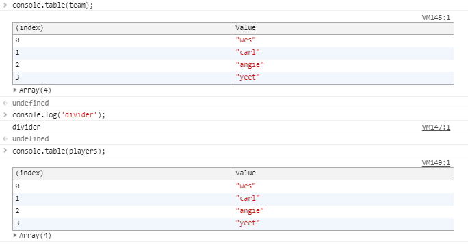

# Notes on Project 13 - Reference versus Copy

## New methods/ properties
```javascript
  Array.from()
  Array.concat()
  Object.assign()
  JSON.strigify()
```

## Notes

Basic stuff, but when you set a variable equal to another variable, it is *referencing* that variable at the time that that relationship is made.

So if you do the following:
  ```javascript
    let age = 100;
    let age2 = age;

    console.log(age, age2); // => returns 100 100
  ```
And then try to do the following:
  ```javascript
    age = 200;

    console.log(age,age2); // => Will return 200 100
  ```
It won't work because that reference isn't updated when you assign the new value to the parent variable 
  - `age` is the parent variable, `age2` is the child
    - Might not be the most correct terminology

Now how about arrays? Let's say we have the following array and variable that references it:
  ```javascript
    const players = ['wes', 'carl', 'angie', 'grace'];
    const team = players;
  ```
Let's say we try to update an index in team and seem what happens to both
  ```javascript
    team[3] = 'yeet'

    console.table(team);
    console.log('divider');
    console.table(players);
  ```
The console prints out the following:


We were expecting it to update the `team` array, not the `players` array.
  - What happened was that, since we've set `team` as a reference to `players`, when we update the `team` array, it tells it to update `players` instead as `team` doesn't have any actual value
  - It kinda computes like the below pseudocode
  ```javascript
    const players = ['wes', 'carl', 'angie', 'grace'];
    const team = players; => ['wes', 'carl', 'angie', 'grace'];

    team[3] = 'yeet'
      team[3] => players[3] = 'yeet';
  ```
This means that there are explicitly different methods to make a copy of an array and they are as folows:
  - Use the `Array.prototype.concat()` method
    ```javascript
      const team3 = [].concat(players);
    ```
    - Here you initiate an empty array (hence the empty brackets) and then use the concat method to copy the contents of players in
    - `Array.prototype.concat()` takes in either arrays or values in as arguments
  - Use the ES6 spread operator
    - This one's pretty clean and self-explanatory
    - The spread operator allows iterable expressions (arrays, strings, etc) to "spread out" their individual elements
    ```javascript
      const team4 = [...players];
    ```
  
