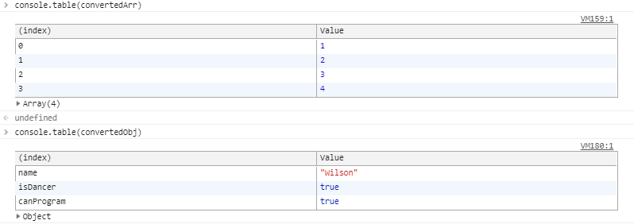

# Notes on Project 15 Local Storage

## Table Of Contents
- [New Methods](#new-methods)
- [New Concepts](#new-concepts)
  - [References](##references)
  - [Local Storage](##local-storage)
  - [Event Delegation](##event-delegation)
    - [Event Bubbling](###event-bubbling)
    - [Application](###application)
- [Architecture](#architecture)
  - [Intro And Variables](##intro-and-variables)
  - [Functions](#functions)
    - [addItem function](##additem-function)
    - [populateList function](##populatelist-function)
    - [toggleDone function](##toggledone-function)

## New methods
```javascript
DOMTokenList.value
localStorage
Event.preventDefault()
Form.reset()
localStorage.setItem()
localStorage.getItem()
HTMLElement.innerHTML
Element.matches()
JSON.stringify()
JSON.parse()
```

## New Concepts

### References

- [MDN Web Storage API Reference](https://developer.mozilla.org/en-US/docs/Web/API/Web_Storage_API/Using_the_Web_Storage_API)
- [Event Delegation Explanation By David Walsh](https://davidwalsh.name/event-delegate)
- [MDN Event Bubbling And Capture](https://developer.mozilla.org/en-US/docs/Learn/JavaScript/Building_blocks/Events#Event_bubbling_and_capture)
- [MDN <input type ="submit"](https://developer.mozilla.org/en-US/docs/Web/HTML/Element/input/submit)
- [MDN DOMTokenList.value reference](https://developer.mozilla.org/en-US/docs/Web/API/DOMTokenList/value)
-[MDN Element.matches()](https://developer.mozilla.org/en-US/docs/Web/API/Element/matches)

### Local Storage

Local storage is part of the Web Storage API and the vast majority of browsers support it to a certain degree.
  - The Web Storage API provides mechanisms by which browsers can securely store key/value pairs, in a much more intuitive fashion than using cookies.
    - Key/ value pairs here are stored as strings (including integers)
    - Storage keys and values are both stored in the UTF-16 DOMString format, which uses 2 bytes per character.
  - This allows you to have data that will persist even if you refresh the page


Storing strings is pretty straight forwards, you just use the following
  ```javascript
  const string = 'hello there';
  localStorage.setItem('hello', string);
  ```

And to retrieve it and print it to console, you use:
  ```javascript
  console.log(localStorage.getItem('hello'));
  ```

Note that you can't just store an object/ array without first converting it to a string like so:
```javascript
const arr = [1,2,3,4];
const obj = {
  name: 'Wilson',
  isDancer: true,
  canProgram: true
}
localStorage.setItem('storedArray',JSON.stringify(arr));
localStorage.setItem('storedObj', JSON.stringify(obj));
```

We can then fetch it like so:
```javascript
const getArr = localStorage.getItem('storedArray');
const getObj = localStorage.getItem('storedObj');

// convert back to original form
const convertedArr = JSON.parse(getArr);
const convertedObj = JSON.parse(getObj);
```

The end result is this:


### Event Delegation

Event delegation takes advantage of Event bubbling on the DOM in order to handle events on multiple children.

#### Event Bubbling

So what is event bubbling? Event bubbling is something that a browser performs when an event is triggered in the DOM. It's also known as *Event Propagation*

When an event is triggered, the browser goes through an event bubbling phase (and an event capture phase which is related but different) which does the following:
  - checks if the element clicked (or any event) has an event handler registered, and runs it if so
  - checks if the next immediate ancestor has an event handler and runs that if so
  :
  - continues checking until it hits the `html` element

A diagram for event bubbling (and capture) can be found below


**Note: By default, all modern browsers handle events in the bubbling phase!**

#### Application

We take advantage of this in event delegation by having the parent element handle the event listener, and then using JavaScript to determine which child element was triggered.

In the instance of this JavaScript30 project, we need event delegation as the user will be adding DOM element in that we need to manipulate.

Below is the unordered list element that we'll be manipulating using JS and several example items that can go in it.
  ```html
    <ul class="plates">
        <li>
          <input type="checkbox" data-index=1 id="item1">
          <label for="item1">Fish</label>
        </li>
        <li>
          I'm not the target hahahahaha
        </li>
        <li>
          <input type="checkbox" data-index=2 id="item2">
          <label for="item2">Squid</label>
        </li>
    </ul>
  ```

Instead of selecting every `li` element and adding event listeners to each of the target elements, we select the `ul` element instead and then add an event listener to that.
  - Just to demonstrate event propagation/ bubbling, we'll also add the `li` elements in

  ```javascript
  const itemList = document.querySelector('.plates');
  const listEles = document.querySelectorAll('li');

  itemList.addEventListener('click',(e)=>{
    console.log('I am the ul element being triggered');
    checkEvent(e);
  });

  listEles.forEach((listEle)=>
    listEle.addEventListener('click',(e)=>{
    console.log('I am the li element being triggered');
  }));
  ```

The callback function `checkEvent` is fairly simple. It just prints a message if we clicked on the desired element and returns if we clicked some other element.
  ```javascript
  function checkEvent(e){
    if (!e.target.dataset.index){
      return;
    };
    console.log(`Hello, I have selected ${e.target.id}`);
  }
  ```

So, when we click on either the Fish, or Squid inputs we trigger an event bubbling phase. 
  - First it checks the input and label elements to see if there's an event listener attached
    - Unfortunately since the input and label elements are attached to each other, we end up triggering the event twice
  - Then the JS script bubbles upwards to the next ancestor
    - Here it's the `li` element and since we have an event listener attached, it runs and prints the message that we've told it to print
  - Then it bubbles upwards to the next ancestor
    - Here it's the `ul.plates` element, and it has an event listener which then runs and sends the event to the provided callback function
  - And it keeps bubbling/ propagating upwards until it reaches the `html` element

**See** `example-delegation.html` **for an example of event delegation**

## Architecture

### Intro and variables

We need to do several different things here and they are as follows:

  - We need a function that handles form inputs by putting it into an object
  - We need a function that takes data inputs from a JS array and then adds each object element to the DOM as a list element
  - We need a function that toggles the checkboxes that we generate

So we declare our variables and add our event listeners and they're as follows:
  ```javascript
  const addItems = document.querySelector('.add-items');
  const itemsList = document.querySelector('.plates');
  const items = JSON.parse(localStorage.getItem('items'))|| []);

  addItems.addEventListener('submit', addItem);
  itemsList.addEventListener('click', toggleDone);
  ```

And the variables quickly explained:
  - `addItems` is grabbing the form element with the class *add-items* from the page
  - `itemsList` is grabbing the list element *plates* from the page
  - `items` is a conditional statement that first tries to grab data from Local Storage if it's there, if it doesn't exist, then *items* initiates an empty array

Event listeners are then appended to `addItems` and `itemsList`.
  - The callback function for `addItems` is `addItem`
  - The callback function for `itemsList` is `toggleDone`

### Functions

Now for the functions, of which we have three.

#### addItem Function

The function `addItem(e)` looks like this:
  ```javascript
  function addItem(e){
    e.preventDefault();
    const text = (this.querySelector('[name=item]')).value;
    const item = {
      text,
      done: false
    }
    items.push(item);
    populateList(items, itemsList);
    localStorage.setItem('items',JSON.stringify(items));
    this.reset(); 
  }
  ```
Some notes about this:
  - First, the function takes the `submit` input from the event listener 
  - Form elements by default refresh the page everytime you submit it
    - we use `e.preventDefault()` to prevent that
    - the `Event.preventDefault()` method does what it sounds like, it prevents the default behavior of an event unless explicitly told to handle it that way
  - We then define a variable `text` which grabs whatever was submitted in the form
    - first note is that the `this` keyword refers to the form element, `.add-items` 
      - also we can start reading the DOM from any point on the tree
    - second, when we use a `<input type="submit" value="submit">` in a form, it submits whatever was in the form as a DOMString
      - this can be read via the `DOMTokenList.value` property
  - We also need to creat an object, `item` which has the following properties
    - The property *done*, which is a boolean
    - The property *text*, which takes the value from the submitted form
  - From there we push `item` to the *items* array
  - Then we call another function `populateList()` with the inputs *items* and *itemsList*
    - we'll discuss what it does later
  - Since we want *items* to persist even after we close the page, we'll need to call `localStorage` and save it there as a key named *items*
    - note that since Local Storage saves values as strings, we need to convert *items* to a string via the `JSON.stringify()`
  - Finally, we reset the form so that we can continue adding to it if we want

### populateList Function

The second function, `populateList()` looks like this:
  ```javascript
    function populateList(plates = [], platesList){
      platesList.innerHTML = plates.map((plate,i)=>{
        return `
          <li>
            <input type="checkbox" data-index=${i} id="item${i}" ${plate.done ? 'checked': ''}>
            <label for="item${i}">${plate.text}</label>
          </li>
        `;
      }).join('');
    }
  ```

Explanation as follows:
  - `populateList` takes in two inputs, *plates* and the DOM element, *platesList*
    - `plates` is intended to be an array, and if no value is given then an empty array is initialized and used instead
    - `platesList` is the target list that we're trying to populate
  - There's really technically one line of code, but it's got quite a bit going on
  - What we're trying to do here is to append values from *plates* into the DOM element *platesList*
    - we do that by setting `platesList.innerHTML` equal to the `plates.map().join('')` expression
  - Inside the `.map()` method, we use a function with inputs *plate* and *i*
    - `plate` represents the current element in the array *plates*
      - `plate` also is the object *item*  
    - `i` represents the index value of the current element in the array
    - this function returns a template literal in the form of a HTML list item element with a nested input and label element
      - looks like this:
        ```javascript
          return `
            <li>
              <input type="checkbox" data-index=${i} id="item${i}" ${plate.done ? 'checked': ''}>
              <label for="item${i}">${plate.text}</label>
            </li>
          `;
        ```
      - note that within the input and label tags we include a bunch of variable calls as well
  - After the `.map()` finishes, we use `.join('')` to combine all of the template literals we created

### toggleDone Function

The final function, `toggleDone()` looks like this:
  ```javascript
    function toggleDone(e){
      if(!e.target.matches('input')) return;
      const el = e.target;
      const index = el.dataset.index;
      items[index].done = !items[index].done;
      localStorage.setItem('items',JSON.stringify(items));
      populateList(items,itemsList); 
    }
  ```
This function aims to toggle the checkboxes of the list elements in the HTML file ***regardless of when they were added***

Explanation as follows:
  - First, note that this is where the event delegation portion of the project comes in
  - The input for this function is the `clickEvent` input from the event listener 
  - The first line in the function checks whether or not the target of the click event is the input element we want
    - done via the `Element.matches()` method
    - if the element doesn't match, the function returns
  - We then define a new variable, `el = e.target`, that's the element that triggered the event listener
  - From there we define a new variable,`index` that grabs the *data-index* value from that element
  - After that, we access the clicked element inside the `items` array with the assistance of the new *index* variable 
    - the goal of this is to toggle the *done* property via the logical NOT operator (!)
  - Following that, we access Loca Storage to save the `items` array under the key 'items'
  - Finally we use `populateList` to update the <ul> element with the newest entries